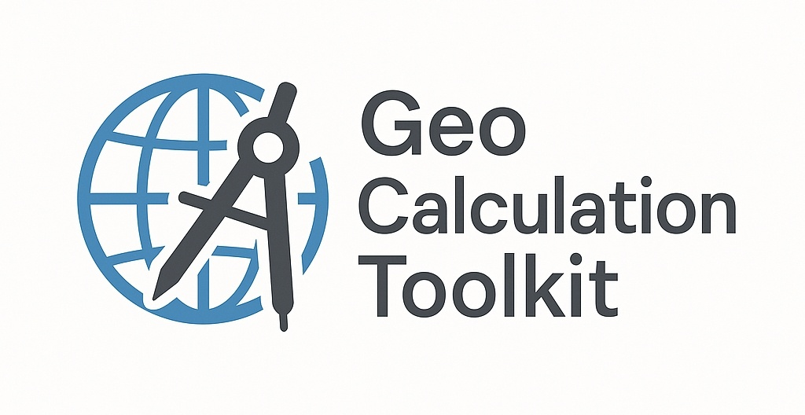

## Introducing the Geo Calculation Toolkit API

**Geo Calculation Toolkit** is a utility-focused API suite for working with geographic coordinates and shapes.

It offers practical functions such as calculating distances, lengths, and containment for points, lines, and areas — useful in location-based logic, simple map processing, or spatial validations in backend services.

---

### API Collection

**↔️ Distance Calculation**

- [Distance between two coordinates](./detail/distance-between-two-coordinates.md)
- [Shortest distance from a coordinate to a line](./detail/shortest-distance-from-a-coordinate-to-a-line.md)
- [Perpendicular distance from a coordinate to a line](./detail/perpendicular-distance-from-a-coordinate-to-a-line.md)

**📏 Length Calculation**

- [Total length of a polyline](./detail/total-length-of-a-polyline.md)
- [Total boundary length of the polygonal area](./detail/total-boundary-length-of-the-polygonal-area.md)
- [Total boundary length of the circular area](./detail/total-boundary-length-of-the-circular-area.md)

**📍 Coordinates Calculation**

- [Closest point on a line from a coordinate](./detail/closest-point-on-a-line-from-a-coordinate.md)
- [Perpendicular foot of a coordinate on a line](./detail/perpendicular-foot-of-a-coordinate-on-a-line.md)
- [Destination coordinate after moving a certain distance toward another coordinate](./detail/destination-coordinate-after-moving-a-certain-distance-toward-another-coordinate.md)
- [Destination coordinate after moving a certain distance in a given bearing](./detail/destination-coordinate-after-moving-a-certain-distance-in-a-given-bearing.md)

**📦 Containment Check**

- [Coordinate containment in a polygonal area](./detail/coordinate-containment-in-a-polygonal-area.md)
- [Coordinate containment in a circular area](./detail/coordinate-containment-in-a-circular-area.md)

**💥 Intersection Check**

- [Intersection between two circular areas](./detail/intersection-between-two-circular-areas.md)
- [Intersection between two polygonal areas](./detail/intersection-between-two-polygonal-areas.md)
- [Intersection between two polylines](./detail/intersection-between-two-polylines.md)
- [Intersection between a polyline and a polygonal area](./detail/intersection-between-a-polyline-and-a-polygonal-area.md)
- [Intersection between a polyline and a circular area](./detail/intersection-between-a-polyline-and-a-circular-area.md)
