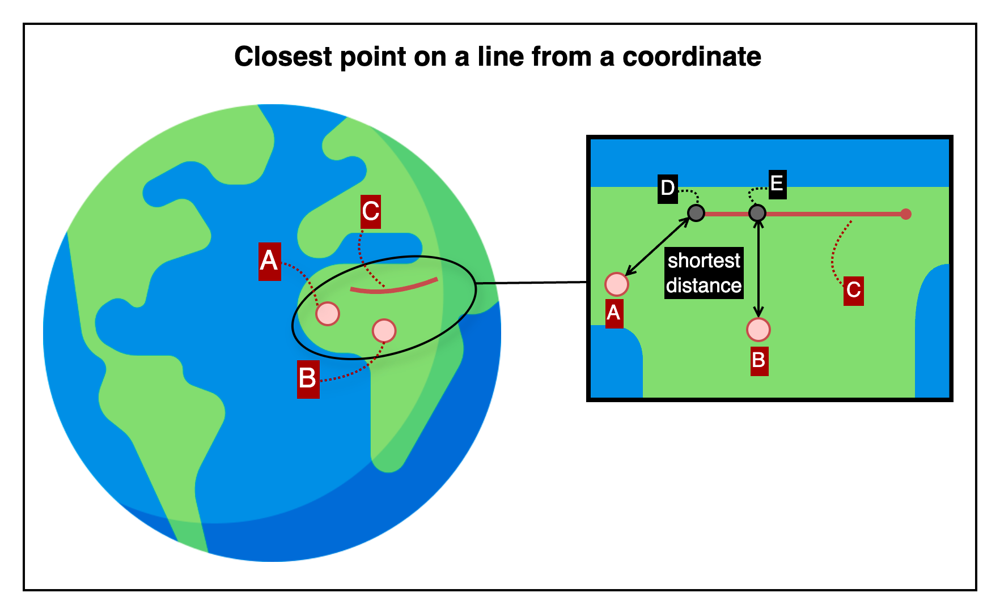

## Closest point on a line from a coordinate

This is an HTTP API that returns the closest point on a line segment defined by two geographic coordinates, given a specific input coordinate.

---

## 📚 Table of Contents

1. [🧭 Overview](#-1-overview) — *For first-time users*
2. [📤 Request Details](#-2-request-details) — *For developers integrating the API*
    1. [Request Example](#21-request-example)
    2. [Request Specifications](#22-request-specifications)
3. [📥 Response Details](#-3-response-details)
    1. [Response Example](#31-response-example)
    2. [Response Specifications](#32-response-specifications)
4. [💥 Error Response Details](#-4-error-response-details)
    1. [Error Response Example](#41-error-response-example)
    2. [Error Response Specifications](#42-error-response-specifications)
    3. [Error Codes](#43-error-codes)
5. [🔗 Reference Links](#-5-reference-links) — *For testing the API and retrieving your API key*

---

## 🧭 1. Overview



This image shows how the API determines the closest point on a line segment defined by two geographic coordinates.
The segment labeled C represents the reference line.
Points A and B are input coordinates, and the API computes the nearest point located on line C for each of them.
These projected points are marked as D and E respectively, and the lines from A to D and from B to E indicate the shortest surface distances.

The API returns the geographic coordinate of the closest point on the line for the input position.

---

## 📤 2. Request Details

### 2.1. Request Example

```http request
POST {{BASE-URL}}/coordinate/closest-on-line
Content-Type: application/json

{
  "coordinate": {
    "lat": 37.618492,
    "lng": 126.920078
  },
  "line": {
    "fromCoordinate": {
      "lat": 37.618515,
      "lng": 126.920021
    },
    "toCoordinate": {
      "lat": 37.618385,
      "lng": 126.920339
    }
  }
}
```

### 2.2. Request Specifications

**2.2.1. Base Endpoint Info**

| API Provider Platform | Method | BASE-URL(HTTP Protocol + Host)                       | Path                          |
|:---------------------:|:------:|------------------------------------------------------|:------------------------------|
|       Rapid API       |  POST  | `https://geo-calculation-toolkit-api.p.rapidapi.com` | `/coordinate/closest-on-line` |

**2.2.2. Request Headers**

| Header Name       | Type   | Required | Description                         |
|-------------------|--------|----------|-------------------------------------|
| `Content-Type`    | string | ✅ Yes    | Must be `application/json`          |
| `X-RapidAPI-Key`  | string | ✅ Yes    | Your API key issued by RapidAPI     |
| `X-RapidAPI-Host` | string | ✅ Yes    | The API host identifier on RapidAPI |

**2.2.3. Request Body**

| Field              | Type   | Required | Description                                                  |
|--------------------|--------|----------|--------------------------------------------------------------|
| `coordinate`       | object | ✅ Yes    | The reference point for which the nearest location is sought |
| └ `lat`            | number | ✅ Yes    | Latitude of the input point                                  |
| └ `lng`            | number | ✅ Yes    | Longitude of the input point                                 |
| `line`             | object | ✅ Yes    | The line segment defined by two coordinates                  |
| └ `fromCoordinate` | object | ✅ Yes    | Starting point of the line                                   |
| └─ `lat`           | number | ✅ Yes    | Latitude of the starting point                               |
| └─ `lng`           | number | ✅ Yes    | Longitude of the starting point                              |
| └ `toCoordinate`   | object | ✅ Yes    | Ending point of the line                                     |
| └─ `lat`           | number | ✅ Yes    | Latitude of the ending point                                 |
| └─ `lng`           | number | ✅ Yes    | Longitude of the ending point                                |

---

## 📥 3. Response Details

### 3.1. Response Example

```json
{
  "success": true,
  "data": {
    "coordinate": {
      "lat": 37.618385,
      "lng": 126.920339
    }
  }
}
```

### 3.2. Response Specifications

| Field          | Type    | Nullable | Description                                                     |
|----------------|---------|----------|-----------------------------------------------------------------|
| `success`      | boolean | ❌ No     | Indicates whether the operation succeeded                       |
| `data`         | object  | ❌ No     | Included only when `success` is `true`                          |
| └ `coordinate` | object  | ❌ No     | The closest point on the line segment from the input coordinate |
| └─ `lat`       | number  | ❌ No     | Latitude of the closest point on the line                       |
| └─ `lng`       | number  | ❌ No     | Longitude of the closest point on the line                      |

---

## 💥 4. Error Response Details

### 4.1. Error Response Example

```http request
400 Bad Request
Content-Type: application/json

{
  "success": false,
  "code": "REQUIRED_PARAMETER_MISSING",
  "message": "Required parameter is missing.",
  "detailMessage": "Required parameter is missing. (fromCoordinate)"
}
```

### 4.2. Error Response Specifications

**4.2.1. Error Response Headers**

| Header Name    | Example Value      | Description                    |
|----------------|--------------------|--------------------------------|
| `Content-Type` | `application/json` | MIME type of the response body |

**4.2.2. Error Response Body**

| Field           | Type    | Nullable | Description                                                                      |
|-----------------|---------|----------|----------------------------------------------------------------------------------|
| `success`       | boolean | ❌ No     | Indicates whether the operation was successful. Always `false` here.             |
| `code`          | string  | ❌ No     | Application-defined error code representing the type of failure.                 |
| `message`       | string  | ❌ No     | General explanation of the error.                                                |
| `detailMessage` | string  | ❌ No     | Additional information providing context about the error for debugging purposes. |

### 4.3. Error Codes

To view the full list of error codes, please visit the link below.

- [Error Codes](./common/error-codes.md)

---

## 🔗 5. Reference Links

- [🚀 Try the API on RapidAPI Console](https://rapidapi.com/your-api/test)  
  Run live requests, view sample code, pricing, and manage your API key—all in one place.


- [💬 Contact Support](mailto:support@yourapi.com)  
  If you have any questions or need help with the API, feel free to email us. We’ll get back to you as soon as possible.

---

[Go to API List](../README)