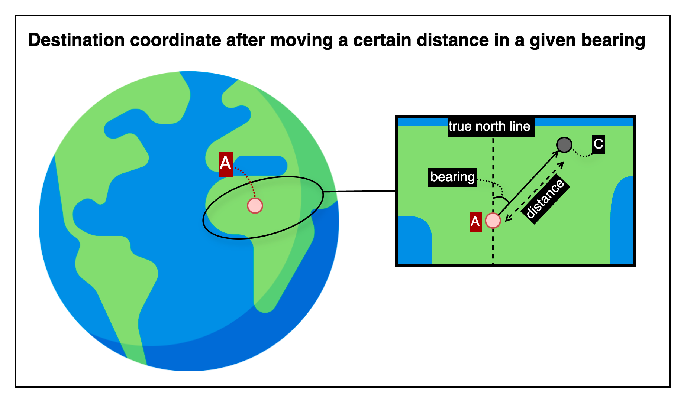

## Destination coordinate after moving a certain distance in a given bearing

This is an HTTP API that calculates the destination coordinate after moving a specified distance in a given bearing from a starting point.

---

## 📚 Table of Contents

1. [🧭 Overview](#-1-overview) — *For first-time users*
2. [📤 Request Details](#-2-request-details) — *For developers integrating the API*
    1. [Request Example](#21-request-example)
    2. [Request Specifications](#22-request-specifications)
3. [📥 Response Details](#-3-response-details)
    1. [Response Example](#31-response-example)
    2. [Response Specifications](#32-response-specifications)
4. [💥 Error Response Details](#-4-error-response-details)
    1. [Error Response Example](#41-error-response-example)
    2. [Error Response Specifications](#42-error-response-specifications)
    3. [Error Codes](#43-error-codes)
5. [🔗 Reference Links](#-5-reference-links) — *For testing the API and retrieving your API key*

---

## 🧭 1. Overview



This image shows how the API calculates a destination coordinate based on a specified starting point, distance, and bearing.

- Point A represents the starting coordinate.
- The dotted arc labeled “bearing” indicates the angular direction measured clockwise from true north.
- The solid arrow line shows the movement from point A along that bearing for the specified distance.
- Point C is the resulting coordinate — the geographic position reached after applying the movement.

The API returns the resulting coordinate calculated using the given bearing and distance from the input point.

---

## 📤 2. Request Details

### 2.1. Request Example

```http request
POST {{BASE-URL}}/coordinate/move-in-bearing
Content-Type: application/json

{
  "coordinate": {
    "lat": 37.618492,
    "lng": 126.920078
  },
  "bearing": 45,
  "distance": 200,
  "distanceUnit": "m"
}
```

### 2.2. Request Specifications

**2.2.1. Base Endpoint Info**

| API Provider Platform | Method | BASE-URL(HTTP Protocol + Host)                       | Path                             |
|:---------------------:|:------:|------------------------------------------------------|:---------------------------------|
|       Rapid API       |  POST  | `https://geo-calculation-toolkit-api.p.rapidapi.com` | `/coordinate/perpendicular-foot` |

**2.2.2. Request Headers**

| Header Name       | Type   | Required | Description                         |
|-------------------|--------|----------|-------------------------------------|
| `Content-Type`    | string | ✅ Yes    | Must be `application/json`          |
| `X-RapidAPI-Key`  | string | ✅ Yes    | Your API key issued by RapidAPI     |
| `X-RapidAPI-Host` | string | ✅ Yes    | The API host identifier on RapidAPI |

**2.2.3. Request Body**

| Field          | Type   | Required   | Description                                               |
|----------------|--------|------------|-----------------------------------------------------------|
| `coordinate`   | object | ✅ Yes      | Starting point from which the movement begins             |
| └ `lat`        | number | ✅ Yes      | Latitude of the starting coordinate                       |
| └ `lng`        | number | ✅ Yes      | Longitude of the starting coordinate                      |
| `bearing`      | number | ✅ Yes      | Bearing in degrees (0–360), where 0° is true north        |
| `distance`     | number | ✅ Yes      | Distance to move along the bearing                        |
| `distanceUnit` | string | ❌ Optional | Unit of distance (`mm`, `m`, `km`, etc.). Defaults to `m` |

---

## 📥 3. Response Details

### 3.1. Response Example

```json
{
  "success": true,
  "data": {
    "coordinate": {
      "lat": 37.618453,
      "lng": 126.920180
    }
  }
}
```

### 3.2. Response Specifications

| Field          | Type    | Nullable | Description                                               |
|----------------|---------|----------|-----------------------------------------------------------|
| `success`      | boolean | ❌ No     | Indicates whether the operation succeeded                 |
| `data`         | object  | ❌ No     | Included only when `success` is `true`                    |
| └ `coordinate` | object  | ❌ No     | Resulting coordinate after moving along the given bearing |
| └─ `lat`       | number  | ❌ No     | Latitude of the resulting coordinate                      |
| └─ `lng`       | number  | ❌ No     | Longitude of the resulting coordinate                     |

---

## 💥 4. Error Response Details

### 4.1. Error Response Example

```http request
400 Bad Request
Content-Type: application/json

{
  "success": false,
  "code": "REQUIRED_PARAMETER_MISSING",
  "message": "Required parameter is missing.",
  "detailMessage": "Required parameter is missing. (fromCoordinate)"
}
```

### 4.2. Error Response Specifications

**4.2.1. Error Response Headers**

| Header Name    | Example Value      | Description                    |
|----------------|--------------------|--------------------------------|
| `Content-Type` | `application/json` | MIME type of the response body |

**4.2.2. Error Response Body**

| Field           | Type    | Nullable | Description                                                                      |
|-----------------|---------|----------|----------------------------------------------------------------------------------|
| `success`       | boolean | ❌ No     | Indicates whether the operation was successful. Always `false` here.             |
| `code`          | string  | ❌ No     | Application-defined error code representing the type of failure.                 |
| `message`       | string  | ❌ No     | General explanation of the error.                                                |
| `detailMessage` | string  | ❌ No     | Additional information providing context about the error for debugging purposes. |

### 4.3. Error Codes

To view the full list of error codes, please visit the link below.

- [Error Codes](./common/error-codes.md)

---

## 🔗 5. Reference Links

- [🚀 Try the API on RapidAPI Console](https://rapidapi.com/your-api/test)  
  Run live requests, view sample code, pricing, and manage your API key—all in one place.


- [💬 Contact Support](mailto:support@yourapi.com)  
  If you have any questions or need help with the API, feel free to email us. We’ll get back to you as soon as possible.

---

[Go to API List](../README)