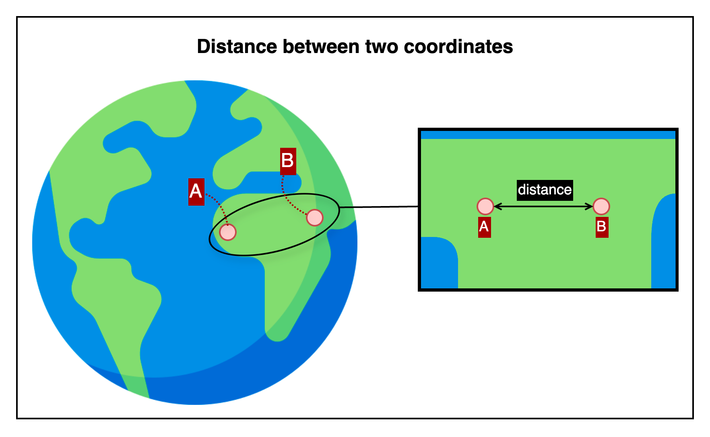

## Distance between two coordinates

This is an HTTP API that calculates the straight-line surface distance between two geographic coordinates.

---

## 📚 Table of Contents

1. [🧭 Overview](#-1-overview) — *For first-time users*
2. [📤 Request Details](#-2-request-details) — *For developers integrating the API*
    1. [Request Example](#21-request-example)
    2. [Request Specifications](#22-request-specifications)
3. [📥 Response Details](#-3-response-details)
    1. [Response Example](#31-response-example)
    2. [Response Specifications](#32-response-specifications)
4. [💥 Error Response Details](#-4-error-response-details)
    1. [Error Response Example](#41-error-response-example)
    2. [Error Response Specifications](#42-error-response-specifications)
    3. [Error Codes](#43-error-codes)
5. [🔗 Reference Links](#-5-reference-links) — *For testing the API and retrieving your API key*

---

## 🧭 1. Overview



This image shows how the API calculates the surface distance between two distinct geographic points on Earth.

- Point A and Point B represent two locations defined by latitude and longitude.
- The arrow between them visually represents the shortest path over the Earth's surface (great-circle distance).

The API returns the surface distance between the two input coordinates.

---

## 📤 2. Request Details

### 2.1. Request Example

```http request
POST {{BASE-URL}}/distance/between-coordinates?unit=m
Content-Type: application/json

{
  "fromCoordinate": {
    "lat": 37.618515,
    "lng": 126.920021
  },
  "toCoordinate": {
    "lat": 37.618385,
    "lng": 126.920339
  }
}
```

### 2.2. Request Specifications

**2.2.1. Base Endpoint Info**

| API Provider Platform | Method | BASE-URL(HTTP Protocol + Host)                       | Path                            |
|:---------------------:|:------:|------------------------------------------------------|:--------------------------------|
|       Rapid API       |  POST  | `https://geo-calculation-toolkit-api.p.rapidapi.com` | `/distance/between-coordinates` |

**2.2.2. Request Headers**

| Header Name       | Type   | Required | Description                         |
|-------------------|--------|----------|-------------------------------------|
| `Content-Type`    | string | ✅ Yes    | Must be `application/json`          |
| `X-RapidAPI-Key`  | string | ✅ Yes    | Your API key issued by RapidAPI     |
| `X-RapidAPI-Host` | string | ✅ Yes    | The API host identifier on RapidAPI |

**2.2.3. Query Parameters**

| Parameter | Type   | Required   | Description                                                                                |
|-----------|--------|------------|--------------------------------------------------------------------------------------------|
| `unit`    | string | ❌ Optional | Unit for the response value (`mm`, `cm`, `m`, `km`, `in`, `ft`, `yd`, `mi`). Default: `m`. |

**2.2.4. Request Body**

| Field            | Type   | Required | Description                        |
|------------------|--------|----------|------------------------------------|
| `fromCoordinate` | object | ✅ Yes    | Starting point coordinates         |
| └`lat`           | number | ✅ Yes    | Latitude of the starting point     |
| └`lng`           | number | ✅ Yes    | Longitude of the starting point    |
| `toCoordinate`   | object | ✅ Yes    | Destination point coordinates      |
| └`lat`           | number | ✅ Yes    | Latitude of the destination point  |
| └`lng`           | number | ✅ Yes    | Longitude of the destination point |

---

## 📥 3. Response Details

### 3.1. Response Example

```json
{
  "success": true,
  "data": {
    "distance": 31.4989,
    "unit": "m"
  }
}
```

### 3.2. Response Specifications

| Field       | Type    | Nullable | Description                                             |
|-------------|---------|----------|---------------------------------------------------------|
| `success`   | boolean | ❌ No     | Indicates whether the operation succeeded               |
| `data`      | object  | ❌ No     | Included only when `success` is `true`                  |
| └`distance` | number  | ❌ No     | Distance between coordinates (4 decimal precision)      |
| └`unit`     | string  | ❌ No     | Unit of measurement (`mm`, `m`, `km`, `ft`, `yd`, `mi`) |

---

## 💥 4. Error Response Details

### 4.1. Error Response Example

```http request
400 Bad Request
Content-Type: application/json

{
  "success": false,
  "code": "REQUIRED_PARAMETER_MISSING",
  "message": "Required parameter is missing.",
  "detailMessage": "Required parameter is missing. (fromCoordinate)"
}
```

### 4.2. Error Response Specifications

**4.2.1. Error Response Headers**

| Header Name    | Example Value      | Description                    |
|----------------|--------------------|--------------------------------|
| `Content-Type` | `application/json` | MIME type of the response body |

**4.2.2. Error Response Body**

| Field           | Type    | Nullable | Description                                                                      |
|-----------------|---------|----------|----------------------------------------------------------------------------------|
| `success`       | boolean | ❌ No     | Indicates whether the operation was successful. Always `false` here.             |
| `code`          | string  | ❌ No     | Application-defined error code representing the type of failure.                 |
| `message`       | string  | ❌ No     | General explanation of the error.                                                |
| `detailMessage` | string  | ❌ No     | Additional information providing context about the error for debugging purposes. |

### 4.3. Error Codes

To view the full list of error codes, please visit the link below.

- [Error Codes](./common/error-codes.md)

---

## 🔗 5. Reference Links

- [🚀 Try the API on RapidAPI Console](https://rapidapi.com/your-api/test)  
  Run live requests, view sample code, pricing, and manage your API key—all in one place.


- [💬 Contact Support](mailto:support@yourapi.com)  
  If you have any questions or need help with the API, feel free to email us. We’ll get back to you as soon as possible.

---

[Go to API List](../README)