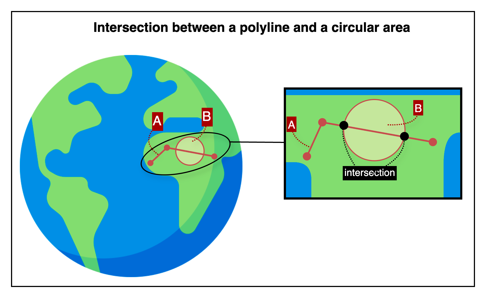

## Intersection between a polyline and a circular area

This is an HTTP API that checks whether a given polyline intersects with a circular area defined by a center coordinate and radius.

---

## 📚 Table of Contents

1. [🧭 Overview](#-1-overview) — *For first-time users*
2. [📤 Request Details](#-2-request-details) — *For developers integrating the API*
    1. [Request Example](#21-request-example)
    2. [Request Specifications](#22-request-specifications)
3. [📥 Response Details](#-3-response-details)
    1. [Response Example](#31-response-example)
    2. [Response Specifications](#32-response-specifications)
4. [💥 Error Response Details](#-4-error-response-details)
    1. [Error Response Example](#41-error-response-example)
    2. [Error Response Specifications](#42-error-response-specifications)
    3. [Error Codes](#43-error-codes)
5. [🔗 Reference Links](#-5-reference-links) — *For testing the API and retrieving your API key*

---

## 🧭 1. Overview



This image shows how the API checks for an intersection between a polyline and a circular area.

- The path labeled A is a polyline, made up of multiple connected geographic coordinates.
- Circle C represents a circular area defined by a center coordinate and a radius.
- In the zoomed-in view, the black dots represent the intersection points where the polyline crosses the boundary of the circular area.

The API returns a boolean value indicating whether the polyline intersects the circular area.

---

## 📤 2. Request Details

### 2.1. Request Example

```http request
POST {{BASE-URL}}/intersection/polyline-circle
Content-Type: application/json

{
  "polyline": [
    { "lat": 37.618492, "lng": 126.920078 },
    { "lat": 37.619100, "lng": 126.921500 },
    { "lat": 37.620300, "lng": 126.922800 }
  ],
  "circle": {
    "center": {
      "lat": 37.619500,
      "lng": 126.921900
    },
    "radius": 150,
    "radiusUnit": "m"
  }
}
```