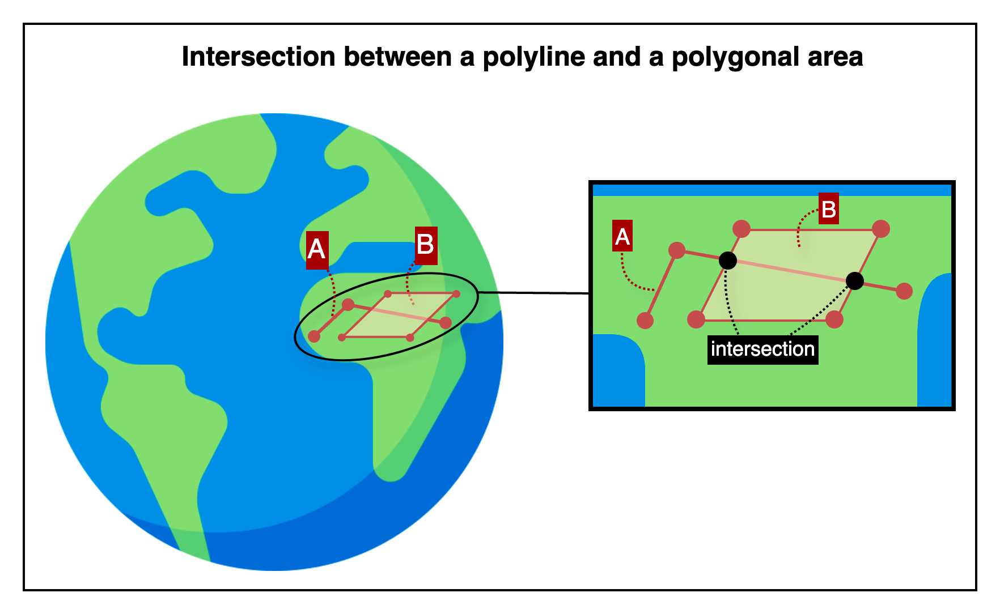

## Intersection between a polyline and a polygonal area

This is an HTTP API that checks whether a given polyline intersects with a polygonal area based on their respective coordinates.

---

## 📚 Table of Contents

1. [🧭 Overview](#-1-overview) — *For first-time users*
2. [📤 Request Details](#-2-request-details) — *For developers integrating the API*
    1. [Request Example](#21-request-example)
    2. [Request Specifications](#22-request-specifications)
3. [📥 Response Details](#-3-response-details)
    1. [Response Example](#31-response-example)
    2. [Response Specifications](#32-response-specifications)
4. [💥 Error Response Details](#-4-error-response-details)
    1. [Error Response Example](#41-error-response-example)
    2. [Error Response Specifications](#42-error-response-specifications)
    3. [Error Codes](#43-error-codes)
5. [🔗 Reference Links](#-5-reference-links) — *For testing the API and retrieving your API key*

---

## 🧭 1. Overview



This image shows how the API determines whether a polyline intersects with a polygonal area.

- Line A represents a polyline composed of connected segments defined by consecutive geographic coordinates.
- Shape B represents a polygonal area formed by an ordered sequence of vertices.
- The zoomed-in view illustrates multiple intersection points where the path of Line A crosses the boundary of Polygon B.

The API returns a boolean value indicating whether the polyline and the polygon intersect.

---

## 📤 2. Request Details

### 2.1. Request Example

```http request
POST {{BASE-URL}}/intersection/polyline-polygon
Content-Type: application/json

{
  "polyline": [
    { "lat": 37.618100, "lng": 126.920100 },
    { "lat": 37.618300, "lng": 126.920300 },
    { "lat": 37.618500, "lng": 126.920200 }
  ],
  "polygon": [
    { "lat": 37.618200, "lng": 126.920050 },
    { "lat": 37.618400, "lng": 126.920050 },
    { "lat": 37.618400, "lng": 126.920250 },
    { "lat": 37.618200, "lng": 126.920250 }
  ]
}
```