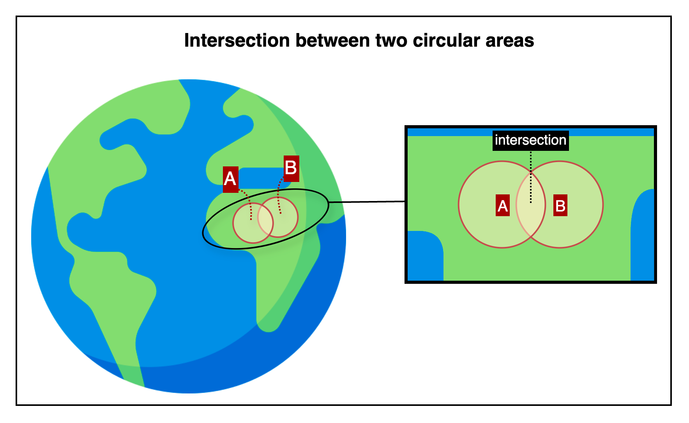

## Intersection between two circular areas

This is an HTTP API that determines whether two circular areas intersect, based on their centers and radii.

---

## 📚 Table of Contents

1. [🧭 Overview](#-1-overview) — *For first-time users*
2. [📤 Request Details](#-2-request-details) — *For developers integrating the API*
    1. [Request Example](#21-request-example)
    2. [Request Specifications](#22-request-specifications)
3. [📥 Response Details](#-3-response-details)
    1. [Response Example](#31-response-example)
    2. [Response Specifications](#32-response-specifications)
4. [💥 Error Response Details](#-4-error-response-details)
    1. [Error Response Example](#41-error-response-example)
    2. [Error Response Specifications](#42-error-response-specifications)
    3. [Error Codes](#43-error-codes)
5. [🔗 Reference Links](#-5-reference-links) — *For testing the API and retrieving your API key*

---

## 🧭 1. Overview



This image shows how the API checks whether two circular areas intersect based on their center coordinates and radii.

- Circle A and Circle B each have their own center coordinate and radius, and are shown overlapping.

The API returns a boolean value indicating whether the two circular areas intersect.

---

## 📤 2. Request Details

### 2.1. Request Example

```http request
POST {{BASE-URL}}/intersection/circle-pair
Content-Type: application/json

{
  "circle1": {
    "centerCoordinate": {
      "lat": 37.618492,
      "lng": 126.920078
    },
    "radius": 200,
    "radiusUnit": "m"
  },
  "circle2": {
    "centerCoordinate": {
      "lat": 37.619410,
      "lng": 126.921330
    },
    "radius": 150,
    "radiusUnit": "m"
  }
}
```

### 2.2. Request Specifications

**2.2.1. Base Endpoint Info**

| API Provider Platform | Method | BASE-URL(HTTP Protocol + Host)                       | Path                        |
|:---------------------:|:------:|------------------------------------------------------|:----------------------------|
|       Rapid API       |  POST  | `https://geo-calculation-toolkit-api.p.rapidapi.com` | `/intersection/circle-pair` |

**2.2.2. Request Headers**

| Header Name       | Type   | Required | Description                         |
|-------------------|--------|----------|-------------------------------------|
| `Content-Type`    | string | ✅ Yes    | Must be `application/json`          |
| `X-RapidAPI-Key`  | string | ✅ Yes    | Your API key issued by RapidAPI     |
| `X-RapidAPI-Host` | string | ✅ Yes    | The API host identifier on RapidAPI |

**2.2.3. Request Body**

| Field                | Type   | Required   | Description                                                  |
|----------------------|--------|------------|--------------------------------------------------------------|
| `circle1`            | object | ✅ Yes      | The first circle to check for intersection                   |
| └ `centerCoordinate` | object | ✅ Yes      | Center point of the first circle                             |
| └─ `lat`             | number | ✅ Yes      | Latitude of the center                                       |
| └─ `lng`             | number | ✅ Yes      | Longitude of the center                                      |
| └ `radius`           | number | ✅ Yes      | Radius of the first circle                                   |
| └ `radiusUnit`       | string | ❌ Optional | Unit of the radius (`mm`, `m`, `km`, etc.) — defaults to `m` |
| `circle2`            | object | ✅ Yes      | The second circle to compare with                            |
| └ `centerCoordinate` | object | ✅ Yes      | Center point of the second circle                            |
| └─ `lat`             | number | ✅ Yes      | Latitude of the center                                       |
| └─ `lng`             | number | ✅ Yes      | Longitude of the center                                      |
| └ `radius`           | number | ✅ Yes      | Radius of the second circle                                  |
| └ `radiusUnit`       | string | ❌ Optional | Unit of the radius (`mm`, `m`, `km`, etc.) — defaults to `m` |

---

## 📥 3. Response Details

### 3.1. Response Example

```json
{
  "success": true,
  "data": {
    "intersected": true
  }
}
```

### 3.2. Response Specifications

| Field           | Type    | Nullable | Description                                                   |
|-----------------|---------|----------|---------------------------------------------------------------|
| `success`       | boolean | ❌ No     | Indicates whether the operation succeeded                     |
| `data`          | object  | ❌ No     | Included only when `success` is `true`                        |
| └ `intersected` | boolean | ❌ No     | `true` if the two circular areas intersect, otherwise `false` |

---

## 💥 4. Error Response Details

### 4.1. Error Response Example

```http request
500 Internal Server Error
Content-Type: application/json

{
  "success": false,
  "code": "INTERNAL_SERVER_ERROR",
  "message": "Internal server error occurred.",
  "detailMessage": "Please try again later. (An error occurred in the internal calculation logic.)"
}
```

### 4.2. Error Response Specifications

**4.2.1. Error Response Headers**

| Header Name    | Example Value      | Description                    |
|----------------|--------------------|--------------------------------|
| `Content-Type` | `application/json` | MIME type of the response body |

**4.2.2. Error Response Body**

| Field           | Type    | Nullable | Description                                                                      |
|-----------------|---------|----------|----------------------------------------------------------------------------------|
| `success`       | boolean | ❌ No     | Indicates whether the operation was successful. Always `false` here.             |
| `code`          | string  | ❌ No     | Application-defined error code representing the type of failure.                 |
| `message`       | string  | ❌ No     | General explanation of the error.                                                |
| `detailMessage` | string  | ❌ No     | Additional information providing context about the error for debugging purposes. |

### 4.3. Error Codes

To view the full list of error codes, please visit the link below.

- [Error Codes](./common/error-codes.md)

---

## 🔗 5. Reference Links

- [🚀 Try the API on RapidAPI Console](https://rapidapi.com/your-api/test)  
  Run live requests, view sample code, pricing, and manage your API key—all in one place.


- [💬 Contact Support](mailto:support@yourapi.com)  
  If you have any questions or need help with the API, feel free to email us. We’ll get back to you as soon as possible.

---

[Go to API List](../README)