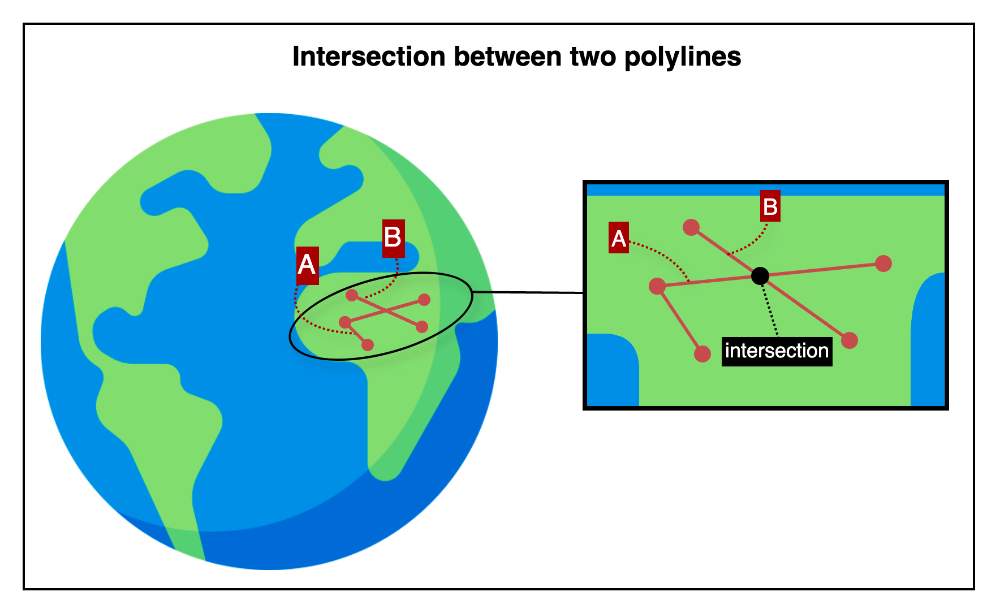

## Intersection between two polylines

This is an HTTP API that determines whether two polylines intersect.

---

## 📚 Table of Contents

1. [🧭 Overview](#-1-overview) — *For first-time users*
2. [📤 Request Details](#-2-request-details) — *For developers integrating the API*
    1. [Request Example](#21-request-example)
    2. [Request Specifications](#22-request-specifications)
3. [📥 Response Details](#-3-response-details)
    1. [Response Example](#31-response-example)
    2. [Response Specifications](#32-response-specifications)
4. [💥 Error Response Details](#-4-error-response-details)
    1. [Error Response Example](#41-error-response-example)
    2. [Error Response Specifications](#42-error-response-specifications)
    3. [Error Codes](#43-error-codes)
5. [🔗 Reference Links](#-5-reference-links) — *For testing the API and retrieving your API key*

---

## 🧭 1. Overview



This image illustrates how the API checks whether two polylines cross each other at any point.

- Two polylines are drawn using ordered sets of coordinates
- Each polyline is labeled A or B, referring to the entire line structure
- The intersection point is where any segment from polyline A crosses polyline B

The API returns a boolean result indicating whether the two polylines intersect at any location.

---

## 📤 2. Request Details

### 2.1. Request Example

```http request
POST {{BASE-URL}}/intersection/polyline-pair
Content-Type: application/json

{
  "polyline1": [
    { "lat": 37.618100, "lng": 126.920100 },
    { "lat": 37.617900, "lng": 126.920500 },
    { "lat": 37.617700, "lng": 126.920900 }
  ],
  "polyline2": [
    { "lat": 37.617800, "lng": 126.920000 },
    { "lat": 37.618000, "lng": 126.920600 }
  ]
}
```

### 2.2. Request Specifications

**2.2.1. Base Endpoint Info**

| API Provider Platform | Method | BASE-URL(HTTP Protocol + Host)                       | Path                          |
|:---------------------:|:------:|------------------------------------------------------|:------------------------------|
|       Rapid API       |  POST  | `https://geo-calculation-toolkit-api.p.rapidapi.com` | `/intersection/polyline-pair` |

**2.2.2. Request Headers**

| Header Name       | Type   | Required | Description                         |
|-------------------|--------|----------|-------------------------------------|
| `Content-Type`    | string | ✅ Yes    | Must be `application/json`          |
| `X-RapidAPI-Key`  | string | ✅ Yes    | Your API key issued by RapidAPI     |
| `X-RapidAPI-Host` | string | ✅ Yes    | The API host identifier on RapidAPI |

**2.2.3. Request Body**

| Field       | Type   | Required | Description                                         |
|-------------|--------|----------|-----------------------------------------------------|
| `polyline1` | array  | ✅ Yes    | Ordered list of coordinates for the first polyline  |
| └ `lat`     | number | ✅ Yes    | Latitude of a point in the polyline                 |
| └ `lng`     | number | ✅ Yes    | Longitude of a point in the polyline                |
| `polyline2` | array  | ✅ Yes    | Ordered list of coordinates for the second polyline |
| └ `lat`     | number | ✅ Yes    | Latitude of a point in the polyline                 |
| └ `lng`     | number | ✅ Yes    | Longitude of a point in the polyline                |

---

## 📥 3. Response Details

### 3.1. Response Example

```json
{
  "success": true,
  "data": {
    "intersected": true
  }
}
```

### 3.2. Response Specifications

| Field           | Type    | Nullable | Description                               |
|-----------------|---------|----------|-------------------------------------------|
| `success`       | boolean | ❌ No     | Indicates whether the operation succeeded |
| `data`          | object  | ❌ No     | Included only when `success` is `true`    |
| └ `intersected` | boolean | ❌ No     | Whether the two polylines intersect       |

---

## 💥 4. Error Response Details

### 4.1. Error Response Example

```http request
500 Internal Server Error
Content-Type: application/json

{
  "success": false,
  "code": "INTERNAL_SERVER_ERROR",
  "message": "Internal server error occurred.",
  "detailMessage": "Please try again later. (An error occurred in the internal calculation logic.)"
}
```

### 4.2. Error Response Specifications

**4.2.1. Error Response Headers**

| Header Name    | Example Value      | Description                    |
|----------------|--------------------|--------------------------------|
| `Content-Type` | `application/json` | MIME type of the response body |

**4.2.2. Error Response Body**

| Field           | Type    | Nullable | Description                                                                      |
|-----------------|---------|----------|----------------------------------------------------------------------------------|
| `success`       | boolean | ❌ No     | Indicates whether the operation was successful. Always `false` here.             |
| `code`          | string  | ❌ No     | Application-defined error code representing the type of failure.                 |
| `message`       | string  | ❌ No     | General explanation of the error.                                                |
| `detailMessage` | string  | ❌ No     | Additional information providing context about the error for debugging purposes. |

### 4.3. Error Codes

To view the full list of error codes, please visit the link below.

- [Error Codes](./common/error-codes.md)

---

## 🔗 5. Reference Links

- [🚀 Try the API on RapidAPI Console](https://rapidapi.com/pepper-craft1-pepper-craft-default/api/geo-calculation-toolkit-api)  
  Run live requests, view sample code, pricing, and manage your API key—all in one place.


- [📬 Email Us](mailto:peppercraft40@gmail.com)  
  For private or sensitive inquiries that should not be shared publicly.

---

[Go to API List](../README)