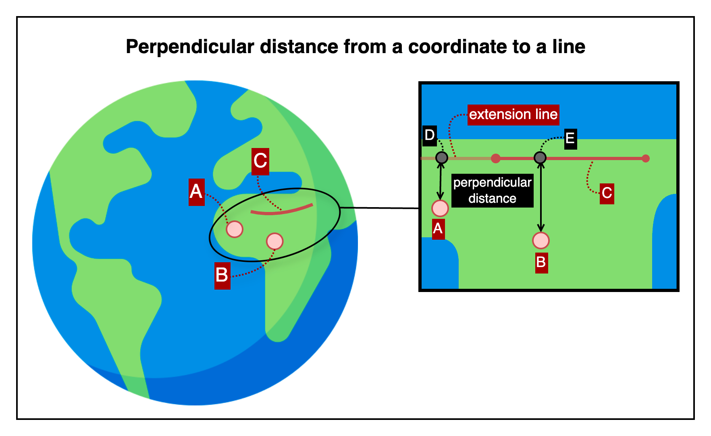

## Perpendicular distance from a coordinate to a line

This is an HTTP API that calculates the perpendicular distance from a coordinate to a specified line segment.

---

## 📚 Table of Contents

1. [🧭 Overview](#-1-overview) — *For first-time users*
2. [📤 Request Details](#-2-request-details) — *For developers integrating the API*
    1. [Request Example](#21-request-example)
    2. [Request Specifications](#22-request-specifications)
3. [📥 Response Details](#-3-response-details)
    1. [Response Example](#31-response-example)
    2. [Response Specifications](#32-response-specifications)
4. [💥 Error Response Details](#-4-error-response-details)
    1. [Error Response Example](#41-error-response-example)
    2. [Error Response Specifications](#42-error-response-specifications)
    3. [Error Codes](#43-error-codes)
5. [🔗 Reference Links](#-5-reference-links) — *For testing the API and retrieving your API key*

---

## 🧭 1. Overview



This image illustrates how coordinates (points A and B) are projected perpendicularly onto a line to find their foot points (e.g., points D and E).

- Coordinates A and B are labeled as input points for which perpendicular distances are computed.
- The line segment used for projection is labeled as C.
- The line can be extended beyond its original endpoints if necessary to reach the perpendicular foot.
- The perpendicular foot is computed for each coordinate along with its shortest distance to the line.

The API returns the perpendicular distance from the input coordinate to the nearest point on the specified line, along with the unit of measurement.

---

## 📤 2. Request Details

### 2.1. Request Example

```http request
POST {{BASE-URL}}/distance/from-point-to-line/perpendicular?unit=m
Content-Type: application/json

{
  "coordinate": {
    "lat": 37.618630,
    "lng": 126.920004
  },
  "line": [
    {
      "lat": 37.618515,
      "lng": 126.920021
    },
    {
      "lat": 37.618385,
      "lng": 126.920339
    }
  ]
}
```

### 2.2. Request Specifications

**2.2.1. Base Endpoint Info**

| API Provider Platform | Method | BASE-URL(HTTP Protocol + Host)                       | Path                                         |
|:---------------------:|:------:|------------------------------------------------------|:---------------------------------------------|
|       Rapid API       |  POST  | `https://geo-calculation-toolkit-api.p.rapidapi.com` | `/distance/from-point-to-line/perpendicular` |

**2.2.2. Request Headers**

| Header Name       | Type   | Required | Description                         |
|-------------------|--------|----------|-------------------------------------|
| `Content-Type`    | string | ✅ Yes    | Must be `application/json`          |
| `X-RapidAPI-Key`  | string | ✅ Yes    | Your API key issued by RapidAPI     |
| `X-RapidAPI-Host` | string | ✅ Yes    | The API host identifier on RapidAPI |

**2.2.3. Query Parameters**

| Parameter | Type   | Required   | Description                                                                                 |
|-----------|--------|------------|---------------------------------------------------------------------------------------------|
| `unit`    | string | ❌ Optional | Unit for the response value (`mm`, `cm`, `m`, `km`, `in`, `ft`, `yd`, `mi`) (default: `m`). |

**2.2.4. Request Body**

| Field        | Type   | Required | Description                                                             |
|--------------|--------|----------|-------------------------------------------------------------------------|
| `coordinate` | object | ✅ Yes    | The reference point from which the perpendicular distance is calculated |
| └ `lat`      | number | ✅ Yes    | Latitude of the input coordinate                                        |
| └ `lng`      | number | ✅ Yes    | Longitude of the input coordinate                                       |
| `line`       | array  | ✅ Yes    | The line segment represented by two coordinates                         |
| └ `lat`      | number | ✅ Yes    | Latitude of a point on the line                                         |
| └ `lng`      | number | ✅ Yes    | Longitude of a point on the line                                        |

---

## 📥 3. Response Details

### 3.1. Response Example

```json
{
  "success": true,
  "data": {
    "distance": 10.6699,
    "unit": "m"
  }
}
```

### 3.2. Response Specifications

| Field        | Type    | Nullable | Description                                                                   |
|--------------|---------|----------|-------------------------------------------------------------------------------|
| `success`    | boolean | ❌ No     | Indicates whether the operation succeeded                                     |
| `data`       | object  | ❌ No     | Included only when `success` is `true`                                        |
| └ `distance` | number  | ❌ No     | Shortest perpendicular surface distance from the input coordinate to the line |
| └ `unit`     | string  | ❌ No     | Unit for the response value (`mm`, `cm`, `m`, `km`, `in`, `ft`, `yd`, `mi`)   |

---

## 💥 4. Error Response Details

### 4.1. Error Response Example

```http request
500 Internal Server Error
Content-Type: application/json

{
  "success": false,
  "code": "INTERNAL_SERVER_ERROR",
  "message": "Internal server error occurred.",
  "detailMessage": "Please try again later. (An error occurred in the internal calculation logic.)"
}
```

### 4.2. Error Response Specifications

**4.2.1. Error Response Headers**

| Header Name    | Example Value      | Description                    |
|----------------|--------------------|--------------------------------|
| `Content-Type` | `application/json` | MIME type of the response body |

**4.2.2. Error Response Body**

| Field           | Type    | Nullable | Description                                                                      |
|-----------------|---------|----------|----------------------------------------------------------------------------------|
| `success`       | boolean | ❌ No     | Indicates whether the operation was successful. Always `false` here.             |
| `code`          | string  | ❌ No     | Application-defined error code representing the type of failure.                 |
| `message`       | string  | ❌ No     | General explanation of the error.                                                |
| `detailMessage` | string  | ❌ No     | Additional information providing context about the error for debugging purposes. |

### 4.3. Error Codes

To view the full list of error codes, please visit the link below.

- [Error Codes](./common/error-codes.md)

---

## 🔗 5. Reference Links

- [🚀 Try the API on RapidAPI Console](https://rapidapi.com/pepper-craft1-pepper-craft-default/api/geo-calculation-toolkit-api)  
  Run live requests, view sample code, pricing, and manage your API key—all in one place.


- [🐞 Open a GitHub Issue](https://github.com/pepper-craft/geo-calculation-toolkit-api-docs/issues)  
  Use this for technical support, API usage questions, feature requests, or bug reports.  
  We respond publicly so others can benefit from the same information.


- [📬 Email Us](mailto:peppercraft40@gmail.com)  
  For private or sensitive inquiries that should not be shared publicly.

---

[Go to API List](../README)