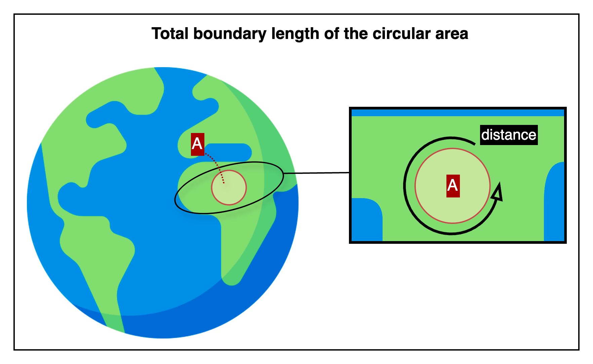

## Total boundary length of the circular area

This is an HTTP API that calculates the total circumference of a circular area based on a given center coordinate and radius.

---

## 📚 Table of Contents

1. [🧭 Overview](#-1-overview) — *For first-time users*
2. [📤 Request Details](#-2-request-details) — *For developers integrating the API*
    1. [Request Example](#21-request-example)
    2. [Request Specifications](#22-request-specifications)
3. [📥 Response Details](#-3-response-details)
    1. [Response Example](#31-response-example)
    2. [Response Specifications](#32-response-specifications)
4. [💥 Error Response Details](#-4-error-response-details)
    1. [Error Response Example](#41-error-response-example)
    2. [Error Response Specifications](#42-error-response-specifications)
    3. [Error Codes](#43-error-codes)
5. [🔗 Reference Links](#-5-reference-links) — *For testing the API and retrieving your API key*

---

## 🧭 1. Overview



This image shows how the API calculates the boundary length of a circular area on the Earth's surface.
In the left view, the circle is defined by a center point labeled A.
In the zoomed view on the right, the ring represents the circular boundary, and the arrow labeled "distance" indicates the total length of that boundary.

The API takes a center coordinate (latitude and longitude) and a radius value as input, and calculates the surface circumference of the resulting circle, considering the curvature of the Earth.

---

## 📤 2. Request Details

### 2.1. Request Example

```http request
POST {{BASE-URL}}/length/circle/boundary?unit=m
Content-Type: application/json

{
  "centerCoordinate": {
    "lat": 37.618492,
    "lng": 126.920078
  },
  "radius": 200,
  "radiusUnit": "m"
}
```

### 2.2. Request Specifications

**2.2.1. Base Endpoint Info**

| API Provider Platform | Method | BASE-URL(HTTP Protocol + Host)                       | Path                      |
|:---------------------:|:------:|------------------------------------------------------|:--------------------------|
|       Rapid API       |  POST  | `https://geo-calculation-toolkit-api.p.rapidapi.com` | `/length/circle/boundary` |

**2.2.2. Request Headers**

| Header Name       | Type   | Required | Description                         |
|-------------------|--------|----------|-------------------------------------|
| `Content-Type`    | string | ✅ Yes    | Must be `application/json`          |
| `X-RapidAPI-Key`  | string | ✅ Yes    | Your API key issued by RapidAPI     |
| `X-RapidAPI-Host` | string | ✅ Yes    | The API host identifier on RapidAPI |

**2.2.3. Query Parameters**

| Parameter | Type   | Required   | Description                                                      |
|-----------|--------|------------|------------------------------------------------------------------|
| `unit`    | string | ❌ Optional | Distance unit (`mm`, `m`, `km`, `ft`, `yd`, `mi`) - defaults `m` |

**2.2.4. Request Body**

| Field              | Type   | Required   | Description                                                              |
|--------------------|--------|------------|--------------------------------------------------------------------------|
| `centerCoordinate` | object | ✅ Yes      | The center point of the circular area                                    |
| └ `lat`            | number | ✅ Yes      | Latitude of the center point                                             |
| └ `lng`            | number | ✅ Yes      | Longitude of the center point                                            |
| `radius`           | number | ✅ Yes      | Radius value of the circle                                               |
| `radiusUnit`       | string | ❌ Optional | Unit of the radius (`mm`, `cm`, `m`, `km`, `ft`, `mi`) - defaults to `m` |

---

## 📥 3. Response Details

### 3.1. Response Example

```json
{
  "success": true,
  "data": {
    "length": 127.3501,
    "unit": "m"
  }
}
```

### 3.2. Response Specifications

| Field      | Type    | Nullable | Description                                                          |
|------------|---------|----------|----------------------------------------------------------------------|
| `success`  | boolean | ❌ No     | Indicates whether the operation succeeded                            |
| `data`     | object  | ❌ No     | Included only when `success` is `true`                               |
| └ `length` | number  | ❌ No     | Total surface length of the polygonal boundary (4 decimal precision) |
| └ `unit`   | string  | ❌ No     | Unit of measurement (`mm`, `m`, `km`, `ft`, `yd`, `mi`)              |

---

## 💥 4. Error Response Details

### 4.1. Error Response Example

```http request
400 Bad Request
Content-Type: application/json

{
  "success": false,
  "code": "REQUIRED_PARAMETER_MISSING",
  "message": "Required parameter is missing.",
  "detailMessage": "Required parameter is missing. (fromCoordinate)"
}
```

### 4.2. Error Response Specifications

**4.2.1. Error Response Headers**

| Header Name    | Example Value      | Description                    |
|----------------|--------------------|--------------------------------|
| `Content-Type` | `application/json` | MIME type of the response body |

**4.2.2. Error Response Body**

| Field           | Type    | Nullable | Description                                                                      |
|-----------------|---------|----------|----------------------------------------------------------------------------------|
| `success`       | boolean | ❌ No     | Indicates whether the operation was successful. Always `false` here.             |
| `code`          | string  | ❌ No     | Application-defined error code representing the type of failure.                 |
| `message`       | string  | ❌ No     | General explanation of the error.                                                |
| `detailMessage` | string  | ❌ No     | Additional information providing context about the error for debugging purposes. |

### 4.3. Error Codes

To view the full list of error codes, please visit the link below.

- [Error Codes](./common/error-codes.md)

---

## 🔗 5. Reference Links

- [🚀 Try the API on RapidAPI Console](https://rapidapi.com/your-api/test)  
  Run live requests, view sample code, pricing, and manage your API key—all in one place.


- [💬 Contact Support](mailto:support@yourapi.com)  
  If you have any questions or need help with the API, feel free to email us. We’ll get back to you as soon as possible.

---

[Go to API List](../README)