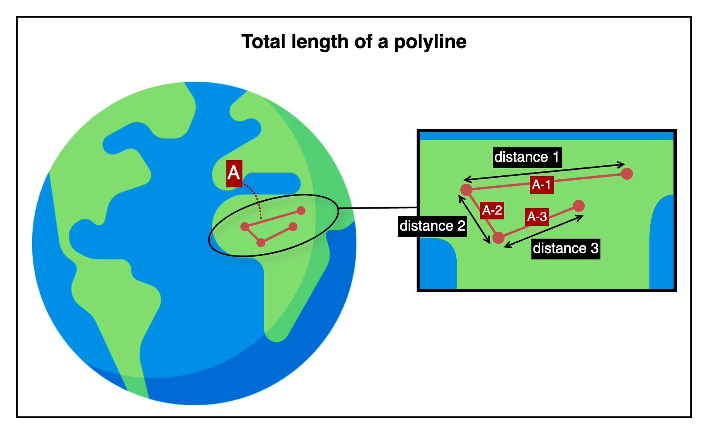

## Total length of a polyline

This is an HTTP API that calculates the total surface distance along a polyline formed by multiple geographic coordinates.

---

## 📚 Table of Contents

1. [🧭 Overview](#-1-overview) — *For first-time users*
2. [📤 Request Details](#-2-request-details) — *For developers integrating the API*
    1. [Request Example](#21-request-example)
    2. [Request Specifications](#22-request-specifications)
3. [📥 Response Details](#-3-response-details)
    1. [Response Example](#31-response-example)
    2. [Response Specifications](#32-response-specifications)
4. [💥 Error Response Details](#-4-error-response-details)
    1. [Error Response Example](#41-error-response-example)
    2. [Error Response Specifications](#42-error-response-specifications)
    3. [Error Codes](#43-error-codes)
5. [🔗 Reference Links](#-5-reference-links) — *For testing the API and retrieving your API key*

---

## 🧭 1. Overview



This image shows how the API calculates the total distance of a polyline made up of multiple connected line segments.
The entire polyline is labeled as A. It consists of several segments, each marked with a tag such as A-1, A-2, and A-3.
Each segment connects two consecutive geographic coordinates and represents one part of the overall path.

The API calculates the total surface distance by adding up the lengths of all segments that make up polyline A.

---

## 📤 2. Request Details

### 2.1. Request Example

```http request
POST {{BASE-URL}}/length/polyline?unit=m
Content-Type: application/json

{
  "polyline": [
    { "lat": 37.618492, "lng": 126.920078 },
    { "lat": 37.618385, "lng": 126.920339 },
    { "lat": 37.618210, "lng": 126.920580 },
    { "lat": 37.618050, "lng": 126.920830 }
  ]
}
```

### 2.2. Request Specifications

**2.2.1. Base Endpoint Info**

| API Provider Platform | Method | BASE-URL(HTTP Protocol + Host)                       | Path               |
|:---------------------:|:------:|------------------------------------------------------|:-------------------|
|       Rapid API       |  POST  | `https://geo-calculation-toolkit-api.p.rapidapi.com` | `/length/polyline` |

**2.2.2. Request Headers**

| Header Name       | Type   | Required | Description                         |
|-------------------|--------|----------|-------------------------------------|
| `Content-Type`    | string | ✅ Yes    | Must be `application/json`          |
| `X-RapidAPI-Key`  | string | ✅ Yes    | Your API key issued by RapidAPI     |
| `X-RapidAPI-Host` | string | ✅ Yes    | The API host identifier on RapidAPI |

**2.2.3. Query Parameters**

| Parameter | Type   | Required   | Description                                                                                |
|-----------|--------|------------|--------------------------------------------------------------------------------------------|
| `unit`    | string | ❌ Optional | Unit for the response value (`mm`, `cm`, `m`, `km`, `in`, `ft`, `yd`, `mi`). Default: `m`. |

**2.2.4. Request Body**

| Field      | Type   | Required | Description                                        |
|------------|--------|----------|----------------------------------------------------|
| `polyline` | array  | ✅ Yes    | List of coordinates representing the polyline path |
| └ `lat`    | number | ✅ Yes    | Latitude of the coordinate                         |
| └ `lng`    | number | ✅ Yes    | Longitude of the coordinate                        |

---

## 📥 3. Response Details

### 3.1. Response Example

```json
{
  "success": true,
  "data": {
    "length": 142.9837,
    "unit": "m"
  }
}
```

### 3.2. Response Specifications

| Field      | Type    | Nullable | Description                                                |
|------------|---------|----------|------------------------------------------------------------|
| `success`  | boolean | ❌ No     | Indicates whether the operation succeeded                  |
| `data`     | object  | ❌ No     | Included only when `success` is `true`                     |
| └ `length` | number  | ❌ No     | Total surface length of the polyline (4 decimal precision) |
| └ `unit`   | string  | ❌ No     | Unit of measurement (`mm`, `m`, `km`, `ft`, `yd`, `mi`)    |

---

## 💥 4. Error Response Details

### 4.1. Error Response Example

```http request
400 Bad Request
Content-Type: application/json

{
  "success": false,
  "code": "REQUIRED_PARAMETER_MISSING",
  "message": "Required parameter is missing.",
  "detailMessage": "Required parameter is missing. (fromCoordinate)"
}
```

### 4.2. Error Response Specifications

**4.2.1. Error Response Headers**

| Header Name    | Example Value      | Description                    |
|----------------|--------------------|--------------------------------|
| `Content-Type` | `application/json` | MIME type of the response body |

**4.2.2. Error Response Body**

| Field           | Type    | Nullable | Description                                                                      |
|-----------------|---------|----------|----------------------------------------------------------------------------------|
| `success`       | boolean | ❌ No     | Indicates whether the operation was successful. Always `false` here.             |
| `code`          | string  | ❌ No     | Application-defined error code representing the type of failure.                 |
| `message`       | string  | ❌ No     | General explanation of the error.                                                |
| `detailMessage` | string  | ❌ No     | Additional information providing context about the error for debugging purposes. |

### 4.3. Error Codes

To view the full list of error codes, please visit the link below.

- [Error Codes](./common/error-codes.md)

---

## 🔗 5. Reference Links

- [🚀 Try the API on RapidAPI Console](https://rapidapi.com/your-api/test)  
  Run live requests, view sample code, pricing, and manage your API key—all in one place.


- [💬 Contact Support](mailto:support@yourapi.com)  
  If you have any questions or need help with the API, feel free to email us. We’ll get back to you as soon as possible.

---

[Go to API List](../README)